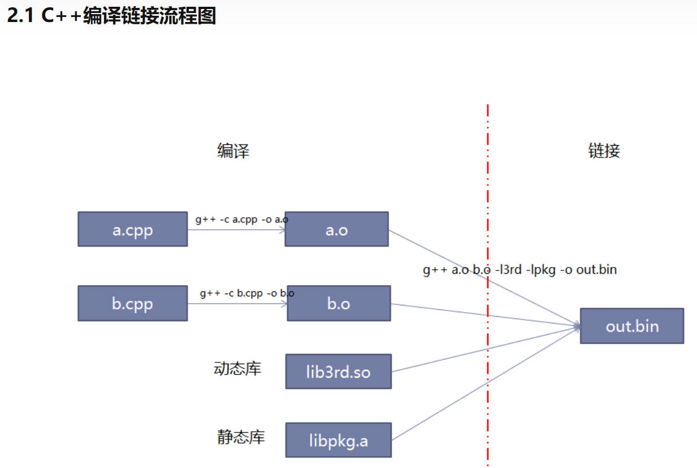

# 编写执行程序前
- Step 1: 确定要解决的问题
- Step 2: 设计一个解决方案
- Step 3: 编写一个实现该解决方案的程序
- Step 4: Compile
- Step 5: Link
- Step 6: Test
- Step 7: Debug

# cpp文件的编译、链接、运行
## 编译和链接
- 编译，代码编译到二进制：g++ -c cpp文件名.cpp -o a.o
- 链接，多个二进制链接成执行程序：g++ cpp文件名.o(可以是多个) -静态库名 -动态库名(都不需要后缀) -o out.bin
  
## 流程图示意

    

[详细可参考：Makefile教程](https://zhuanlan.zhihu.com/p/396448133#:~:text=2.%20C%2B%2B%E7%BC%96%E8%AF%91%E9%93%BE%E6%8E%A5%20/%20%E7%BC%96%E8%AF%91%E6%97%B6%E5%92%8C%E8%BF%90%E8%A1%8C%E6%97%B6)